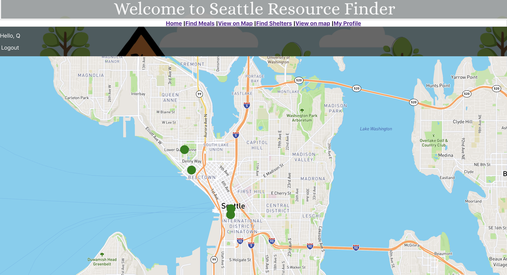
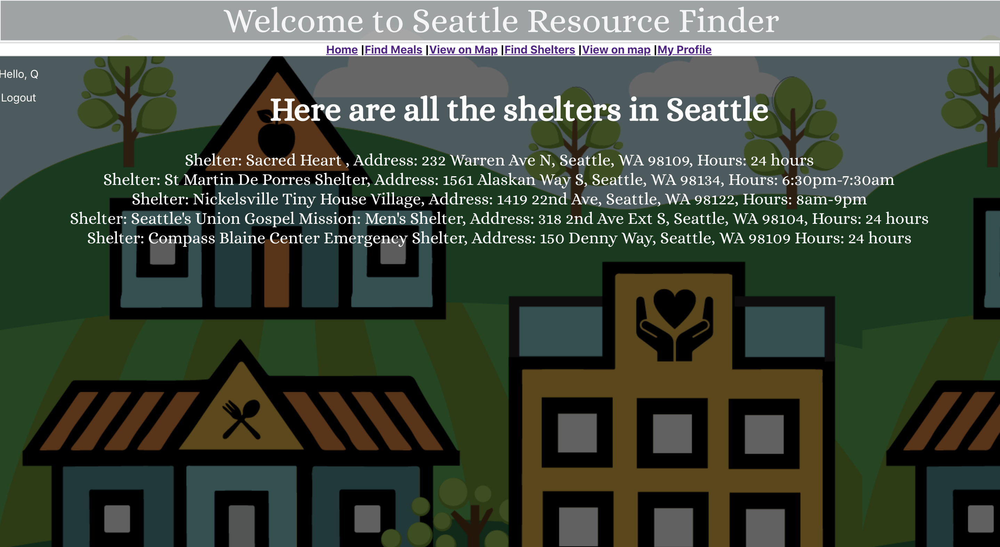
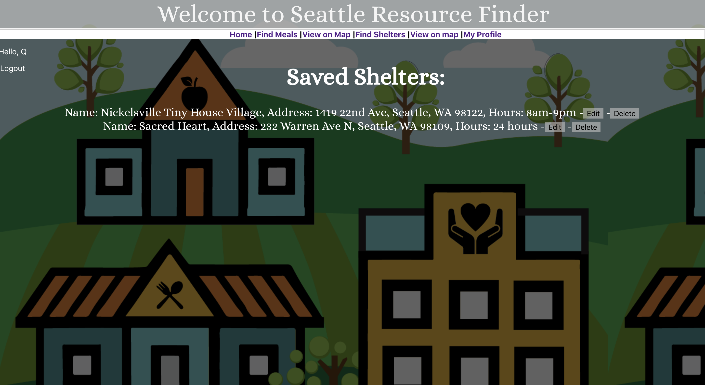
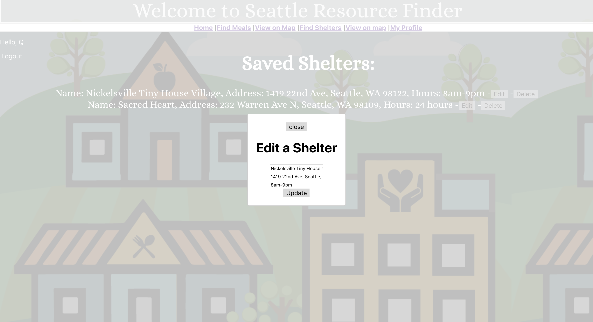

# Seattle Resource Finder
Made by River Droz

# What is Seattle Resource Finder?
Seattle Resource Finder is an application to help the homeless in the city of Seattle, Wa find resources such as meals and shelters. It includes a list of meals and shelters from around the city and shows them on a map. The application also lets the users save the information that they are interested in to their profile page.

# Layout

# Technologies used
ReactJs
Express
MongoDb
Mongoose
Axios

# Sources
[SeattleOpenDataProgram](https://data.seattle.gov/dataset/meal-programs/9mhm-rrwt)

[Mapbox](https://www.mapbox.com/)

[StackOverflow](www.tackoverflow.com)

[Google](www.google.com)

[ReactDocs](https://reactjs.org)

